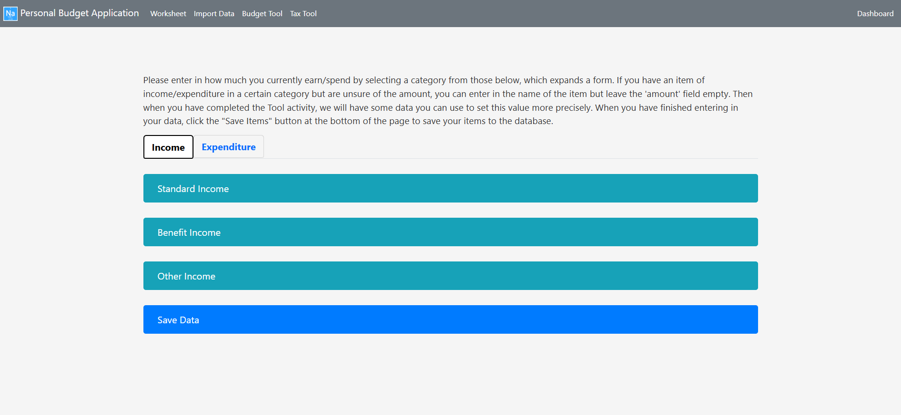
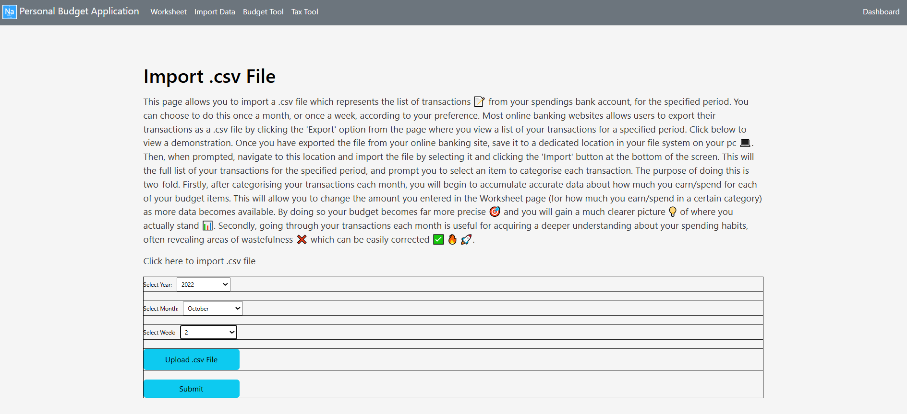
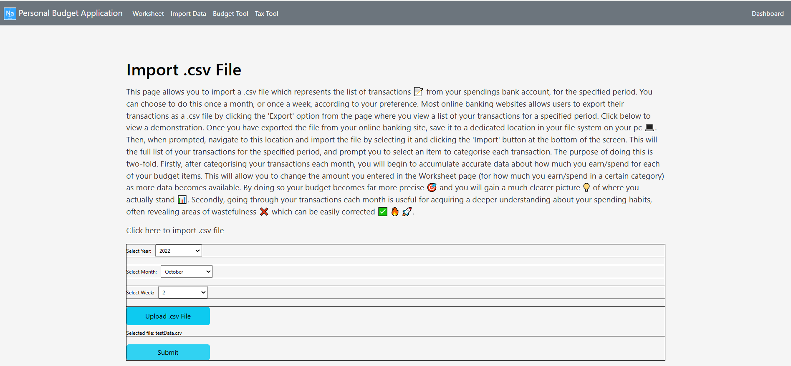
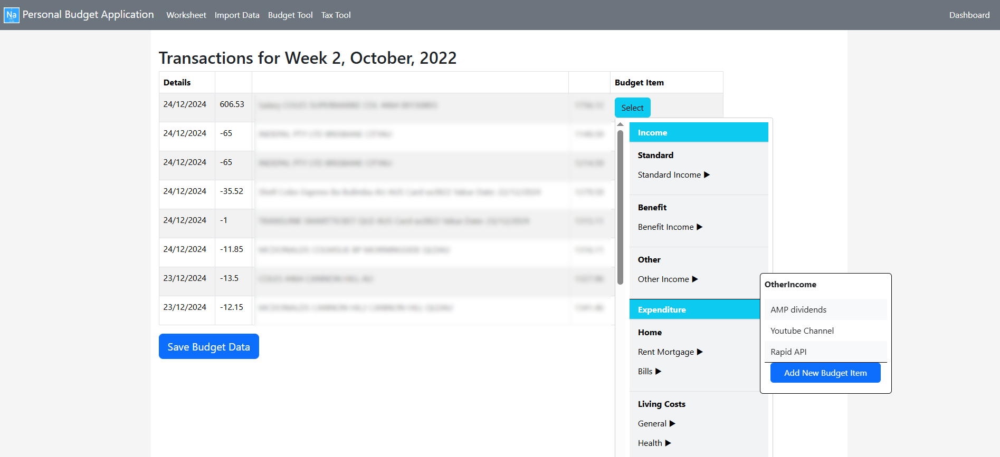

# Personal Budgeting Web Application

A full-stack web application for managing personal budgets.  
Built with **React.js** (frontend), **Express.js** (backend), and **MySQL** (database).

## Features

1. **Worksheet Page** – Allows users to record income and expenditure for each budget item.
2. **ImportData Page** – Securely upload monthly bank transactions via CSV, categorize each transaction, and accumulate precise data on spending and earnings.
3. **BudgetTool Page** – Complete the budget worksheet with suggested values based on recorded transaction data for greater accuracy.
4. **TaxTool Page** – Manage and organize tax items by financial year, upload receipts, and export a tax summary PDF for tax returns.
5. **Dashboard Page** – Visualize key budget statistics and spending habits through interactive charts for a selected period.

## Detailed Features
The application consists of 5 primary features (activities the user completes):

1. A Budget **Worksheet** page which prompts the user to record the amount they currently earn/spend for each of their budget items. 
2. An **ImportData** page which allows the user to securely upload a .csv file which contains their bank transactions each month. They are then prompted to categorise each transaction by assigning it to one of their budget items. By doing so, they begin to accumulate data about their spending/earning which is saved and stored securely in the application database. This data is then used to help the user determine exactly how much they are currently earning/spending in each of their budget items. This feature is what sets the application apart from most online budget tools, which prompt the user to enter in how much they earn/spend in each of their budget items. But many people do not know exactly how much they earn/spend in every item and are forced to make an estimate (which are often wrong and lead to an inaccurate picture of where they stand financially). This is especially important if you consider that one of the keys of successful budgeting is accounting: knowing eactly how much we earn/spend. The user can also use this page to designate a transaction and save it as a tax item.
3. A **BudgetTool** page which allows the user to complete their budget worksheet they started in the Worksheet page. For all of the budget items the user left blank in the Worksheet page (because they did not how much they were currently earning/spending for that item), the user can now enter a precise value for that item using a suggested value which is pre-populated based on how much the user earned/spent for that item since they started recording data.
4. There is also a **TaxTool** feature which displays the user's tax items for a selected financial year. The user can add new tax items here, or add details to their existing tax items for the selected finanical year which they added by completing the ImportData activity each month. The user can upload receipts, add additional details, and categorise each of their tax items for the financial year. then when it comes time to prepare their tax return at the end of financial year, this page exports the user's tax summary (with all the required information ) as a pdf document they can either use themselves to complete their tax return, or give to their accountant to complete it for them.
5. Finally, the **Dashboard** page presents a visual summary of the user's budget key budget statistics for a selected period. The data is presented interactive charts which allows the user to see exactly where their money is going and analyse their spending habits.

## Technologies Used

- **Frontend**: React.js, styled-components, Chart.js (for data visualizations)
- **Backend**: Express.js, Node.js, Knex.js (for database queries)
- **Database**: MySQL
- **Data Processing**: Python, Pandas (for data exploration and mining)
- **Version Control**: Git & GitHub

## Getting Started

### Prerequisites

- Node.js
- MySQL
- Python 3 (used for data processing in backend routes)

### Installation

To run the application follow the steps outlined below:

1. Clone the repository:  
git clone https://github.com/nathanLee256/personal-budget-app

2. Navigate to the project folder:  
cd personal-budget-app

3. Install frontend dependencies:  
npm install

4. Navigate to the backend folder:  
cd backend

5. Install backend dependencies:  
npm install

6. Configure the MySQL database:  
- Create a database and user in MySQL.  
- Update your database connection settings (e.g., in knexfile.js or .env).

7. Run the backend server:  
npm start

8. Return to the frontend folder and start the React app:  
cd ../frontend  
npm start

## Screenshots

### Home Page

### Login Example

### Worksheet Example

#### Worksheet Landing Page

#### Entering Budget Items

#### Saving Data

### Import Data Example

#### Import Data Landing

#### Uploading .csv file

#### Submitting Upload

#### Categorising Transactions

### Dashboard Example

## Why This App is Unique

Unlike most budgeting tools that rely on user estimates, this application helps users **derive precise income and expenditure values** from their actual bank transactions. This eliminates guesswork and provides an accurate picture of personal finances — one of the key principles of effective budgeting.

## Future Improvements

- Implement user authentication with JWT for enhanced security.
- Add unit and integration tests for backend routes.
- Deploy the app using services like Vercel (frontend) and Render (backend).
- Add mobile-responsive design for better usability on smaller screens.

## License

This project is licensed under the MIT License - see the [LICENSE](LICENSE) file for details.

